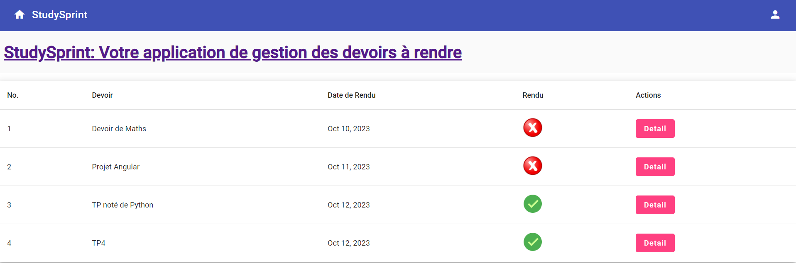
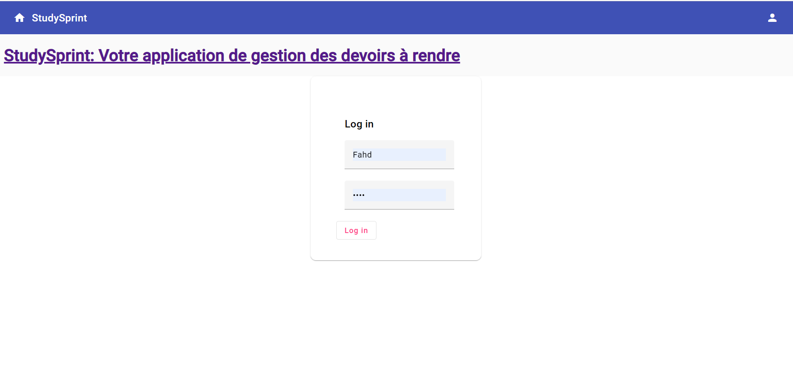
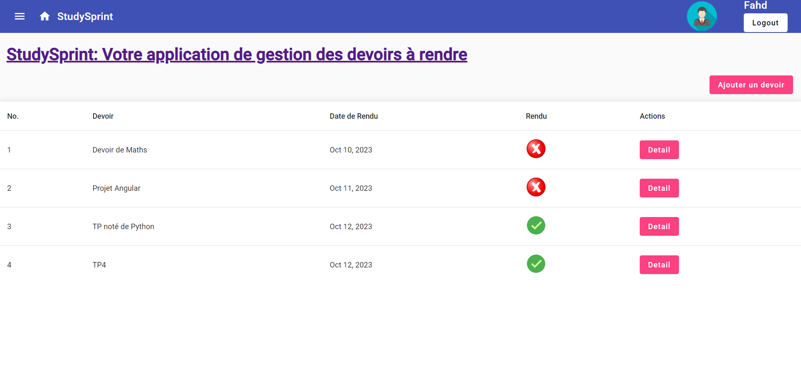
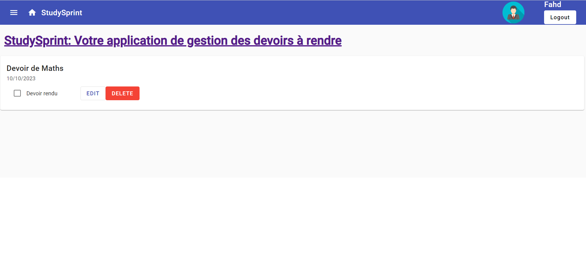
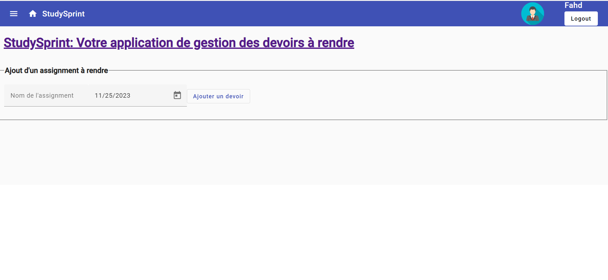
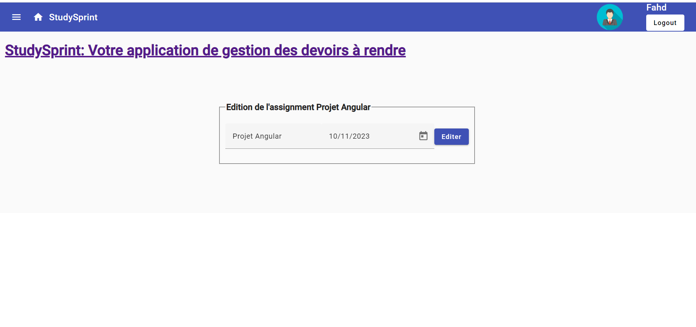
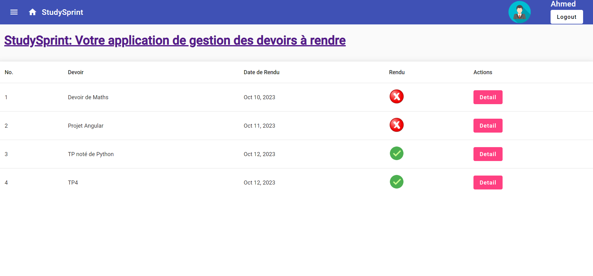
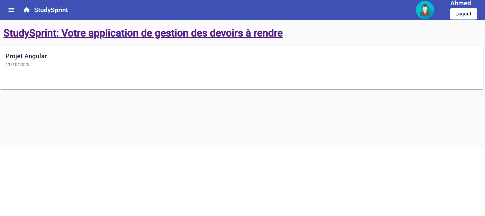

[](https://classroom.github.com/open-in-codespaces?assignment_repo_id=12968987)
# Angular-start
## Ennia Fahd, Etudiant en Master MBDS de Université Côte d'Azur (UniCA)
Démarrage de Projet Installation :

* Si vous utilisez le github Codespace, alors dans votre machine virtuelle `npm`, `node` et `angular/CLI` sont déjà installés.
* Pour cloner en local ce repository, il faut :
   1. avoir installé `git` (ou `gitbash`) sur votre machine
   1. créer un répertoire de travail et s'y déplacer
   1. cloner le repository distant
```bash
git clone nom-du-repository
```


### Pour vérifier que l'installation est complète

```bash 
npm --version
node --version
ng version
```

## StudySprint App
Bienvenue dans notre application StudySprint de gestion de devoirs développée avec Angular. Cette application offre une plateforme conviviale pour gérer efficacement les devoirs, offrant aux utilisateurs une expérience fluide et intuitive. Grâce à l'utilisation de composants Angular, les utilisateurs peuvent naviguer facilement à travers la liste des devoirs, visualiser les détails, ajouter de nouveaux devoirs, rendre les devoirs et effectuer des modifications en toute simplicité. Consultez le guide complet ci-dessous pour explorer toutes les fonctionnalités et maximiser votre expérience avec notre application de gestion de devoirs.
## Rendu 1
### Contenu : 
Tout d'abord, le document détaille le processus de création d'un composant en utilisant l'interface de ligne de commande (CLI) d'Angular. Ensuite, il met en avant l'intégration de ces composants dans d'autres composants, tout en explorant la technique d'interpolation des données au sein de ces éléments.

Les directives structurelles telles que *ngIf et *ngFor sont présentées, avec un renvoi à la page correspondante à partir de 28 pour des informations plus approfondies.

En outre, les directives ngStyle, ngClass, ainsi que des directives personnalisées sont examinées à la page à partir de 43.

Le document couvre également les concepts de liaison d'attributs (property binding), de liaison d'événements (event binding) et de liaison bidirectionnelle (two-way binding). Les formulaires, avec l'utilisation de FormsModule et la création d'une classe modèle, sont également inclus dans le contenu.

Une section spécifique se concentre sur l'intégration du module MatDatepicker pour la mise en place d'un sélecteur de date, détaillée aux pages à partir de 55.

Par ailleurs, il est souligné qu'une partie de la "Partie 5" a été incorporée dans le "Rendu 1". Cette section requiert la création de deux composants supplémentaires : l'un pour afficher les détails d'un devoir au clic, et l'autre pour ajouter un nouveau devoir. Ces extensions enrichissent les fonctionnalités de l'application Angular.

## Rendu 2
### Contenu : 

Intégration avec succès de la Toolbar et la Navbar du premier rendu pour une esthétique professionnelle de l'interface utilisateur et la visualisation des listes de devoirs en premiers temps. Vous trouverez une identification sécurisée par login/password pour accéder à l'application. Dans le service d'authentification, un tableau a été ajouté, regroupant des informations de login, password et rôle (utilisateur ou administrateur) pour renforcer la sécurité et la gestion des droits.

Le code a été amélioré avec l'ajout des fonctions isLogged() et isAdmin(), offrant une gestion plus complète des autorisations. Vous découvrirez également un nouveau bouton de connexion avec une icône matérielle appropriée. Ce bouton redirige vers un composant dédié avec un formulaire de connexion simplifié.

La gestion des droits a été implémentée de manière approfondie. Les administrateurs peuvent éditer et supprimer des devoirs, tandis que les utilisateurs peuvent consulter les détails. Si un utilisateur n'est pas connecté, ses actions sont limitées, ne pouvant ni voir les détails, ni effectuer des éditions.

En parallèle, des services essentiels ont été ajoutés, un routage efficace entre les différentes vues de l'application a été mis en place, et une communication fluide entre les composants a été établie pour garantir une expérience utilisateur cohérente et réactive.

Pour plus de détails sur chaque fonctionnalité, veuillez vous référer au code source et aux interfaces de l'application. Profitez pleinement de votre utilisation de l'application StudySprint de gestion de devoirs !

## Interfaces :

### Acceuil (avant  Login) 

### Login 

### Acceuil (aprés Login et en mode Admin) 


### Détaille d'un devoir (Admin)

### Ajout des devoirs (Admin)

### Edition d'un devoir (Admin)

### Acceuil (aprés Login et en mode User) 

### Détaille d'un devoir (User)


